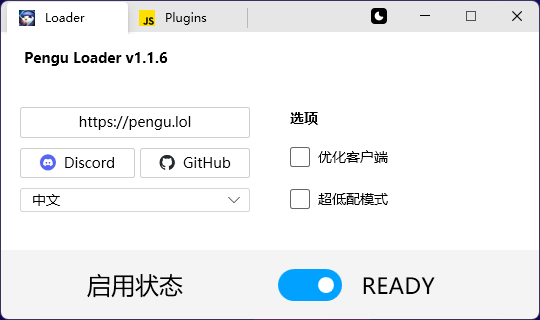
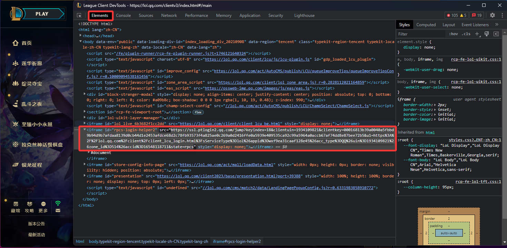
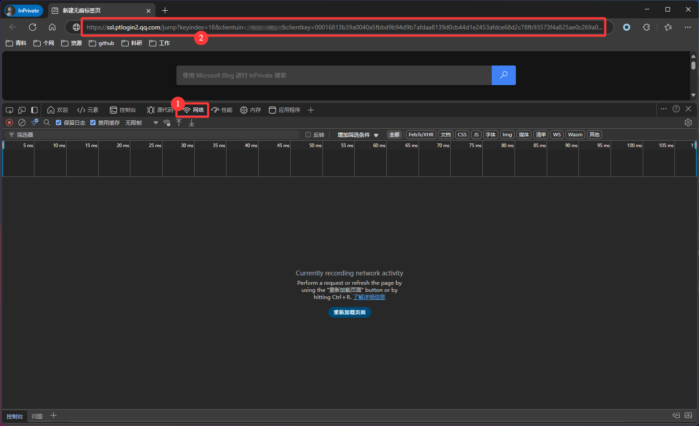
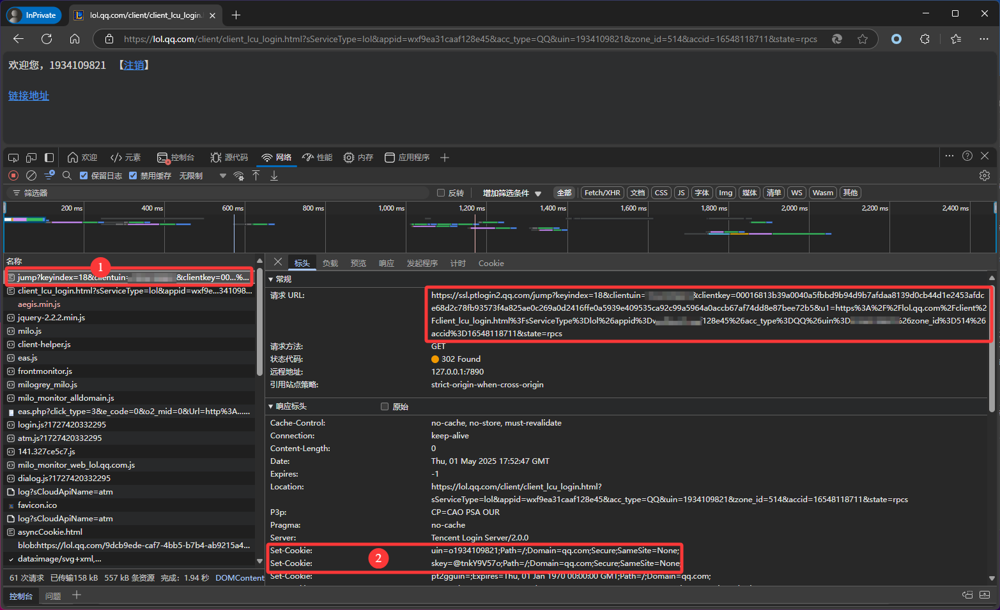

# 英雄联盟自动接受对局工具


## 开发环境

`python3`

> 需要以管理员身份运行脚本 ！！！


## 自动补充骰子的使用

- 先启动 [pengu loader](https://github.com/PenguLoader/PenguLoader)



- 在英雄联盟界面按 F12 进入开发者模式，查看联盟的HTML源码:



- 找到这个 iframe 元素中的 src 链接：

```html
<iframe id="rpcs-login-helper2" src="https://ssl.ptlogin2.qq.com/jump?***"
```
 
- 打开浏览器，在新建标签页中按 F12 进入开发者模式：



- 访问上面的 src 链接，在第一个请求的响应头的 set-cookie 中可以找到 uin 和 skey 值:




> uin 和 skey 的有效期多久目前还不知道，一旦骰子补充有问题就手动更新一下吧！